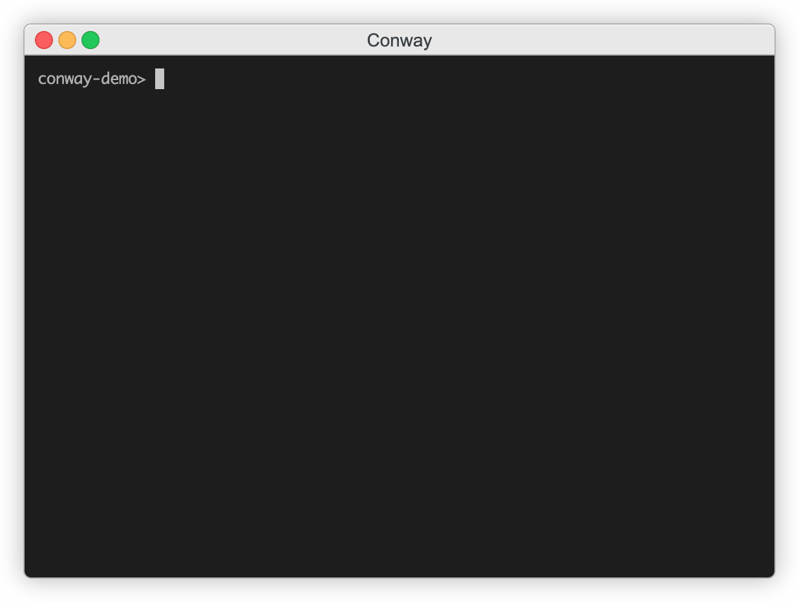

# Conway's Game of Life
This is a visualization program of John Conway's [game of life](https://en.wikipedia.org/wiki/Conway%27s_Game_of_Life) algorithm that can read from [RLE pattern files](https://www.conwaylife.com/wiki/Run_Length_Encoded).



The algorithm is a [celluar automation](https://en.wikipedia.org/wiki/Cellular_automaton) where each cell in the grid either comes to "life" or "dies" or stays as it is based on the status of the eight surrounding cells. 

The rules:  
1. a living cell with 2 or 3 living neighbors stays alive.
2. a dead cell with three lving neighbors comes to life.
3. Everything else either dies or stays dead.

The rules are applied to every cell in the grid over and over. Watching a visualization makes it seem like things happen at random, however, things happen based on the original status of cells in the grid.  

It's a game that plays itself. The only thing you do is set the starting grid.


## Installation
```
git clone https://github.com/breakthatbass/conway.git
cd conway
make install
```

## Uninstall
```
cd conway
make uninstall
```

## Usage
For quick usage simply run  
```
conway		# randomly place living cells and size grid according to terminal size
```
```
conway [ -u, -p <pattern>, -f <file.rle> ]
```
```
conway -p built-in-pattern		# use one of the built in patterns
conway -f path/to/file.rle		# use a run length encoded pattern file
conway -u						# show usage
```
## Patterns

There are thousands of [Life starting patterns](https://www.conwaylife.com/wiki/Category:Patterns) that are easy to find on the internet. Using the `.rle` file format is the easiest way to read in patterns in this program. If you click the link you'll be able to find `.rle` files of pretty much every pattern out there. This repo also has 3 pattern `.rle` files to try out. 

Using the built-in patterns is an option too. Using the `-u` flag will list the current built-in patterns. And you can easily add your own too, however, this option will probably removed soon since it's easier and simpler to read from pattern files.

## ToDo
- add tests
- remove built-in patterns and rely on `.rle` files
- add feature to read from `stdin` so you can `curl` web hosted files into program.